### Основная часть

### 1. 

ответ  на вопрос 12

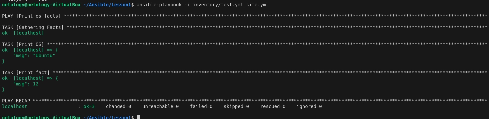

### 4

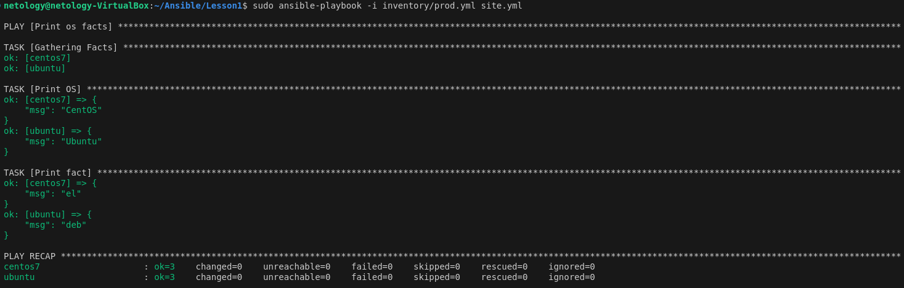

### 6

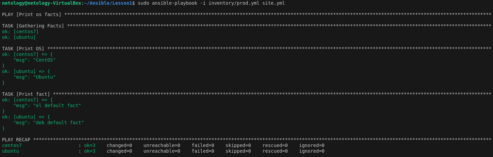

### 7 

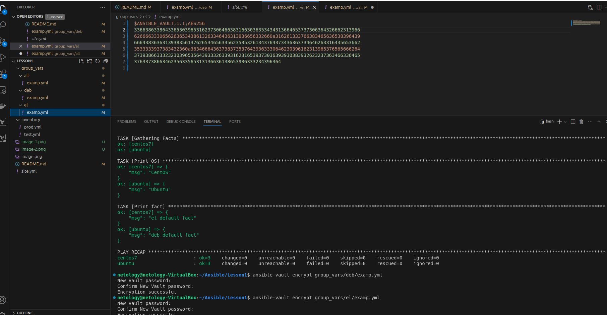

### 8

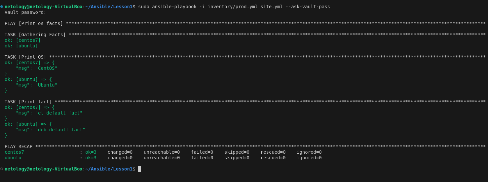

### 9  выбираем local

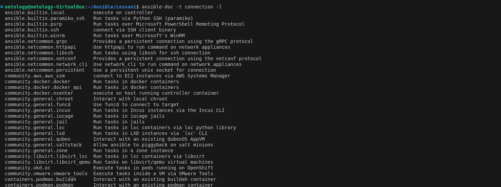

### 11 

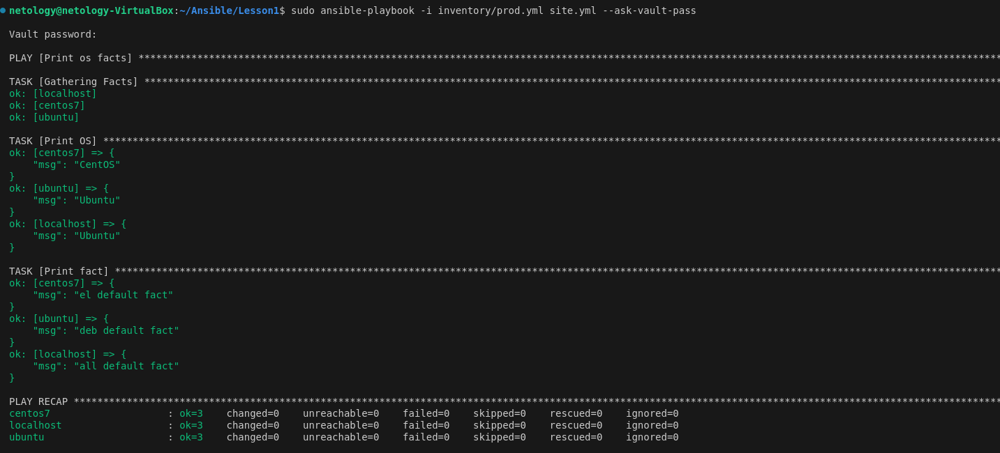

#### Необязательная часть

### 1

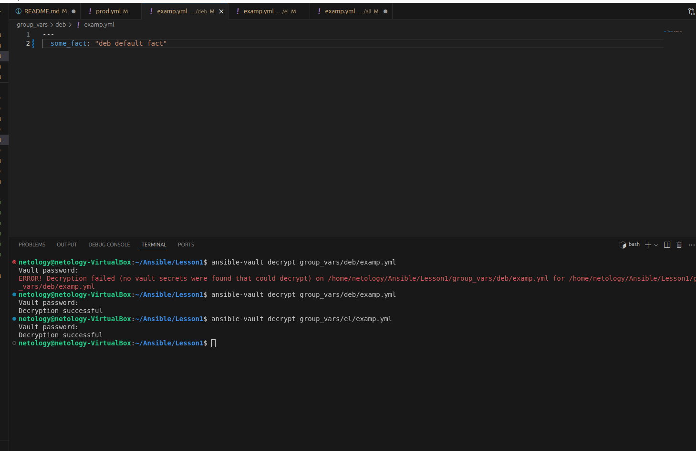

### 2 

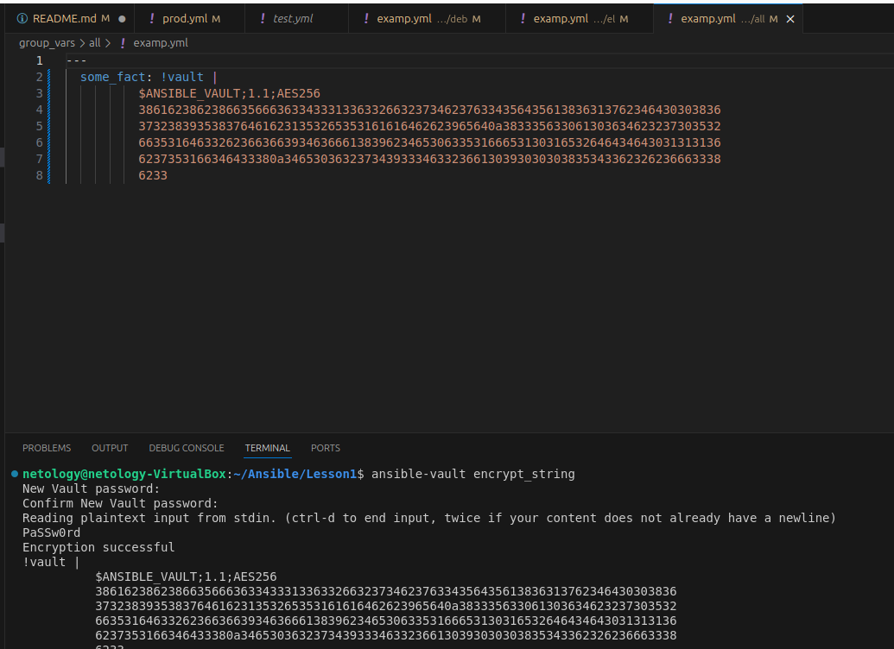

### 3 

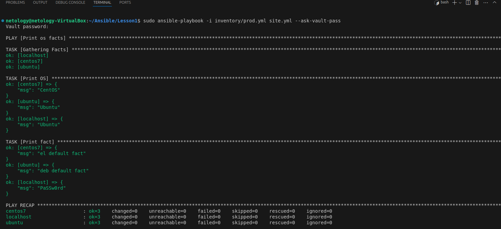

### 4

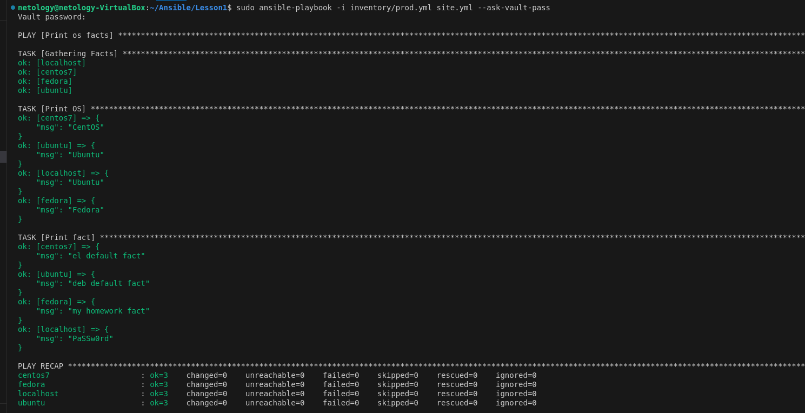

### 5 

[скрипт](https://github.com/Drewplonq/Ansible-Lesson1/blob/master/automation.sh)
